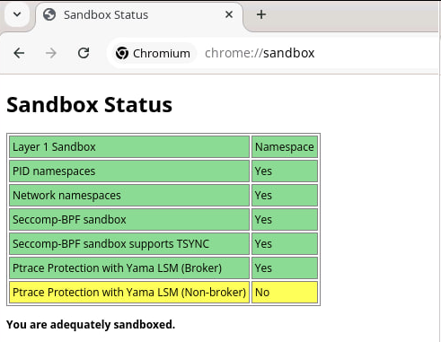
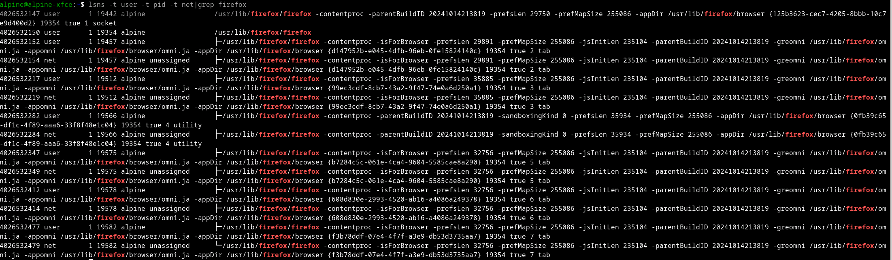

# Namespaces


**To better understand why the warnings & why the solutions, it is recommended to read:**

* [x] The TLDR is that it's a way to isolate user and group IDs between processes, like creating a "mini operating system" inside the real operating system.
* [x] In a user namespace, a process can think it's running as the root user (with all the usual admin powers), but in reality, it's still a regular user outside of that namespace.
* [x] This allows AppImages (& Variants) think they have full control, but in fact, they are limited to what the outer system allows.
* [x] Some distros like [Ubuntu](https://ubuntu.com/blog/ubuntu-23-10-restricted-unprivileged-user-namespaces) disable it using AppArmor for security: [https://ubuntu.com/blog/ubuntu-23-10-restricted-unprivileged-user-namespaces](https://ubuntu.com/blog/ubuntu-23-10-restricted-unprivileged-user-namespaces) (Also see [https://getsol.us/2024/07/15/dropping-apparmor-kernel-patches/](https://getsol.us/2024/07/15/dropping-apparmor-kernel-patches/) & [https://github.com/linuxmint/mint22-beta/issues/82](https://github.com/linuxmint/mint22-beta/issues/82))
* [x] But you can disable that, and just use modern Sandboxing Tools like [BubbleWrap](https://github.com/containers/bubblewrap) & [firejail](https://github.com/netblue30/firejail). Or Wrappers like [AISAP](https://github.com/mgord9518/aisap) & [Chains](https://github.com/xplshn/chains)


***

### Check


```bash
!#Check if it's enabled at Kernel Level
sysctl -n user.max_user_namespaces
#This will print a number
#if it doesn't or it's user.max_user_namespaces = 0, then it's disabled

!#Check if it's enabled/restricted Using unshare : https://man7.org/linux/man-pages/man1/unshare.1.html
unshare --user echo "Username namespaces supported"
#If Suporrted: Username namespaces supported
#If Not: unshare: unshare(0x10000000): Operation not permitted

!#Check if AppArmor|SeLinux is stopping us 
sudo dmesg | grep -E '(selinux|apparmor|security)'
#Look for lines containing words like denied, disallowing etc
```


***

### Errors & Solutions


* [x] **`READ`**: [https://www.baeldung.com/linux/kernel-enable-user-namespaces](https://www.baeldung.com/linux/kernel-enable-user-namespaces)
* [x] **`READ`**: [https://man7.org/linux/man-pages/man7/namespaces.7.html](https://man7.org/linux/man-pages/man7/namespaces.7.html)
* [x] **`READ`**: [https://man7.org/linux/man-pages/man7/user\_namespaces.7.html](https://man7.org/linux/man-pages/man7/user_namespaces.7.html)
* [x] You will also need to install [`uidmap`](https://command-not-found.com/newuidmap)
* [x] For [Ubuntu (AppArmor)](https://askubuntu.com/questions/1511854/how-to-permanently-disable-ubuntus-new-apparmor-user-namespace-creation-restric): [https://askubuntu.com/questions/1511854/how-to-permanently-disable-ubuntus-new-apparmor-user-namespace-creation-restric](https://askubuntu.com/questions/1511854/how-to-permanently-disable-ubuntus-new-apparmor-user-namespace-creation-restric)


#### <mark style="color:orange;">**`[WARN] Your kernel does not support user namespaces`**</mark>


```bash
!#Because /proc/self/ns/user on your System, doesn't exist
1. You need to install SUID Bubblewrap into the system
#For RunImage, this solution will work, but for others, refer to others.
# wget "https://bin.pkgforge.dev/$(uname -m)/bwrap" -O "/tmp/bwrap"
# sudo cp -f "/tmp/bwrap" "/usr/bin/bwrap" && sudo chmod u+s "/usr/bin/bwrap"

2. You need to run some Packages (that require usernamespace) as ROOT [NOT RECOMMENDED & DANGEROUS]

3. Install a Kernel with user namespaces support like XanMod kernel -> https://xanmod.org
```


#### <mark style="color:orange;">**`[WARN] You must`**</mark><mark style="color:green;">**`Enable`**</mark><mark style="color:orange;">**`unprivileged_userns_clone`**</mark>


```bash
!#Because /proc/sys/kernel/unprivileged_userns_clone == 0
❯ Enable unprivileged_userns_clone
echo "kernel.unprivileged_userns_clone=1" | sudo tee "/etc/sysctl.d/98-unprivileged-userns-clone.conf"
echo "1" | sudo tee "/proc/sys/kernel/unprivileged_userns_clone"
sudo service procps restart
sudo sysctl -p "/etc/sysctl.conf"
#Reboot
```


#### <mark style="color:orange;">**`[WARN] You must`**</mark><mark style="color:green;">**`Enable`**</mark><mark style="color:orange;">**`max_user_namespaces`**</mark>


```bash
!#Because /proc/sys/user/max_user_namespaces == 0
❯ Enable max_user_namespaces
echo "user.max_user_namespaces=10000" | sudo tee "/etc/sysctl.d/98-max-user-namespaces.conf"
echo "100000" | sudo tee "/proc/sys/user/max_user_namespaces"
sudo service procps restart
sudo sysctl -p "/etc/sysctl.conf"
#Reboot
```


#### <mark style="color:orange;">**`[WARN] You must`**</mark><mark style="color:red;">**`Disable`**</mark><mark style="color:orange;">**`userns_restrict`**</mark>


```bash
!#Because /proc/sys/kernel/userns_restrict == 1
❯ Disable userns_restrict
echo "kernel.userns_restrict=0" | sudo tee "/etc/sysctl.d/98-userns.conf"
echo "0" | sudo tee "/proc/sys/kernel/userns_restrict"
sudo service procps restart
sudo sysctl -p "/etc/sysctl.conf"
#Reboot
```


#### <mark style="color:orange;">**`[WARN] You must`**</mark><mark style="color:red;">**`Disable`**</mark><mark style="color:orange;">**`apparmor_restrict_unprivileged_userns`**</mark>


```bash
!#Because /proc/sys/kernel/apparmor_restrict_unprivileged_userns == 1
❯ Disable apparmor_restrict_unprivileged_userns
echo "kernel.apparmor_restrict_unprivileged_userns=0" | sudo tee "/etc/sysctl.d/98-apparmor-unuserns.conf"
echo "0" | sudo tee "/proc/sys/kernel/apparmor_restrict_unprivileged_userns"
sudo service procps restart
sudo sysctl -p "/etc/sysctl.conf"
#Reboot
```


***

### Examples


**Read**: [https://www.baeldung.com/linux/list-namespaces](https://www.baeldung.com/linux/list-namespaces)


#### Chrome/Chromium

```javascript
#In Address Bar
chrome://sandbox
```

<figure><figcaption><p>Chrome Properly Sandboxed in User Namespace</p></figcaption></figure>

#### Other Apps

```bash
#APP_NAME == pkg or the actual binary, & remember to keep the APP RUNNING
lsns -t user -t pid -t net | grep -i "${APP_NAME}"
#Example: lsns -t user -t pid -t net | grep -i "firefox"

#If you get no output, it means it's not enabled/working/supported
Otherwise You will get something like:
```

<figure><figcaption><p>Using <a href="https://man7.org/linux/man-pages/man8/lsns.8.html"><mark style="color:purple;"><strong><code>lsns</code></strong></mark></a> to see, Firefox is Properly Sandboxed in User Namespace</p></figcaption></figure>
