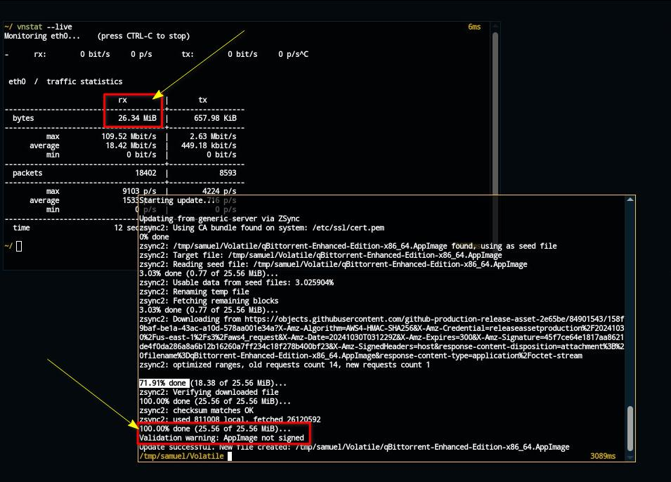

# Zsync

### Is it actually working?


We have been asked why <mark style="color:green;">**we prefer**</mark> <mark style="color:orange;">**`soar update`**</mark>**&#x20;over&#x20;**<mark style="color:orange;">**`appimageupdatetool`**</mark>**&#x20;or&#x20;**<mark style="color:orange;">**`zsync`**</mark>

1. The statment [here](https://github.com/AppImageCommunity/AppImageUpdate/blob/d08e085cc6d40bcda85c4ff4ff275a0b0ce444cc/README.md?plain=1#L39) is **misleading**: [https://github.com/AppImageCommunity/AppImageUpdate/blob/d08e085cc6d40bcda85c4ff4ff275a0b0ce444cc/README.md?plain=1#L39](https://github.com/AppImageCommunity/AppImageUpdate/blob/d08e085cc6d40bcda85c4ff4ff275a0b0ce444cc/README.md?plain=1#L39)
2. In our testing, **we found almost all appimages that have zsync updateinfo embedded, use the&#x20;**<mark style="color:red;">**full**</mark> <mark style="color:purple;">**bandwidth**</mark>**&#x20;regardless**
3. <mark style="color:orange;">**`Soar Update`**</mark> is not only better, but **actually checks for&#x20;**<mark style="color:green;">**version**</mark> prior to wasting any bandwidth along with comparing <mark style="color:purple;">**Checksums**</mark>
4. &#x20;Below, you can verify it yourself


* [x] Install [**VNStat**](https://github.com/vergoh/vnstat) from your [distro](https://command-not-found.com/vnstat), or from [source](https://github.com/vergoh/vnstat/blob/master/INSTALL.md) or just **use** [**Soar**](https://github.com/pkgforge/soar)

> 
> ```bash
> soar add "vnstat#bin" "vnstatd#bin"
> ```
> 

* [x] Run <mark style="color:orange;">**`vnstatd`**</mark> (Terminal: 1, **Keep it Running**)


Applies only **if you didn't install it systemwide** & used soar

<pre class="language-bash" data-overflow="wrap"><code class="lang-bash">#Get the Default Config
curl -qfsSL "https://raw.githubusercontent.com/vergoh/vnstat/master/cfg/vnstat.conf" -o "./vnstat.conf"

#Run this in a terminal, call it Terminal 1
<strong>sudo "$(which vnstatd)" --alwaysadd --nodaemon --sync --config "./vnstat.conf"
</strong></code></pre>


<figure><figcaption><p>vnstatd running in Terminal 1</p></figcaption></figure>

* [x] <mark style="color:orange;">**Monitor**</mark>**&#x20;**<mark style="color:purple;">**Live Traffic**</mark> (Terminal: 2, **Keep it Running**)

> 
> ```bash
> #Run this in another terminal, call it Terminal 2
> vnstat --live
> ```
> 

<figure><figcaption><p>vnstat running in Terminal 2</p></figcaption></figure>

* [x] Use [**appimageupdatetool**](https://github.com/AppImageCommunity/AppImageUpdate) OR [**Zsync**](https://docs.appimage.org/packaging-guide/optional/updates.html) (Terminal: 3)

> 
> ```bash
> #Get the Size of your AppImage (NOTE this somewhere)
> du -sh "/path/to/your/appimage"
>
> #Run appimageupdatetool (while still keeping Terminal 1 & 2 Running)
> appimageupdatetool "/path/to/your/appimage"
> ```
> 


* [x] <mark style="color:red;">**Stop**</mark> <mark style="color:orange;">**`vnstat`**</mark> & <mark style="color:orange;">**`vnstatd`**</mark> (Press <mark style="color:orange;">`Ctrl + C`</mark>)

<figure><figcaption><p>rx shows total bandwidth</p></figcaption></figure>

* [x] Notice the <mark style="color:orange;">**`Size`**</mark> of <mark style="color:blue;">**Original AppImage**</mark> & <mark style="color:orange;">**Total Bandwidth**</mark> used

<figure><figcaption><p>QBittorrent using full bandwidth regardless of "delta" updates</p></figcaption></figure>

* [x] Re Run the entire test, but this time use <mark style="color:orange;">**`soar update`**</mark>&#x20;


- Notice, **it only uses little to no bandwidth to compare the version to our** [**remote repositories**](https://docs.pkgforge.dev/repositories)
- Notice, **if update is found, both&#x20;**<mark style="color:orange;">**zsync-appimages**</mark>**&#x20;&&#x20;**<mark style="color:orange;">**soar update**</mark>**&#x20;use&#x20;**<mark style="color:orange;">**equal**</mark> <mark style="color:purple;">**bandwidth**</mark>. <mark style="color:red;">**There's no actual**</mark> [<mark style="color:orange;">**`Delta Update`**</mark>](https://en.wikipedia.org/wiki/Delta_update)for <mark style="color:orange;">**zsync-appimages**</mark>

