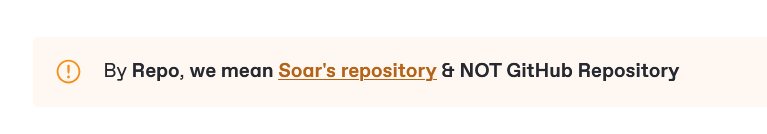

# 19.Tag


```yaml
#Example ONLY
tag:
  - "app-emulation"
  - "emulators"
  - "game"
  - "system"
```


* [x] This is Optional & can be left empty or removed completely (**TYPE**:<mark style="color:green;">**`RECOMMENDED`**</mark>)
* [x] This contains tags for better <mark style="color:orange;">**`soar search`**</mark> as the existing [<mark style="color:purple;">**`Category`**</mark>](7.category.md) is quite Limited & Strict
* [x] Can have single or multiple entries


Example on Github, the tag could be remote-desktop, rdp etc




