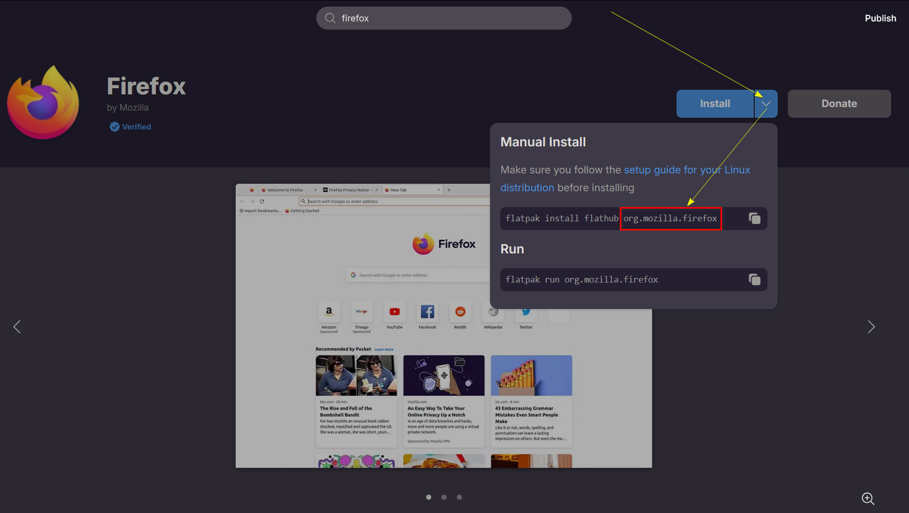
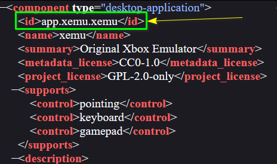

# 4. AppID

```yaml
#Example ONLY
app_id: "Appstream App Id, flatpak's scheme preferred, otherwise can be empty"
```

* [x] <mark style="color:purple;">**`app_id`**</mark> is [AppStream App Id](https://www.freedesktop.org/software/appstream/docs/chap-Metadata.html#tag-id-generic). (**TYPE:**<mark style="color:green;">**`RECOMMENDED`**</mark>)
* [x] You can find the <mark style="color:purple;">**`app_id`**</mark> by searching it on [Flathub](https://flathub.org/)

<figure><figcaption><p>Finding <code>app_id</code> of FireFox on <a href="https://flathub.org/">FlatHub</a></p></figcaption></figure>

* [x] You can also find it in [**Appstream**](https://www.freedesktop.org/software/appstream/docs/) **`Appdata.xml`** or **`Metainfo.xml`** files

<figure><figcaption><p>Finding <code>app_id</code> from AppStream</p></figcaption></figure>


* Sometimes, this id can also be found in **`.Desktop`** file.
* **If you can't find the** <mark style="color:purple;">**`app_id`**</mark> at all, Just **DO NOT USE IT** or **JUST LEAVE EMPTY**


* [x] <mark style="color:purple;">**`app_id`**</mark> is **USED FOR DESKTOP INTEGRATION**


This is **NOT TO BE CONFUSED** with <mark style="color:purple;">**`pkg_id`**</mark>, <mark style="color:purple;">**`pkg_id`**</mark> **is to identify the pkg**, it is **NOT FOR DESKTOP Integration**

